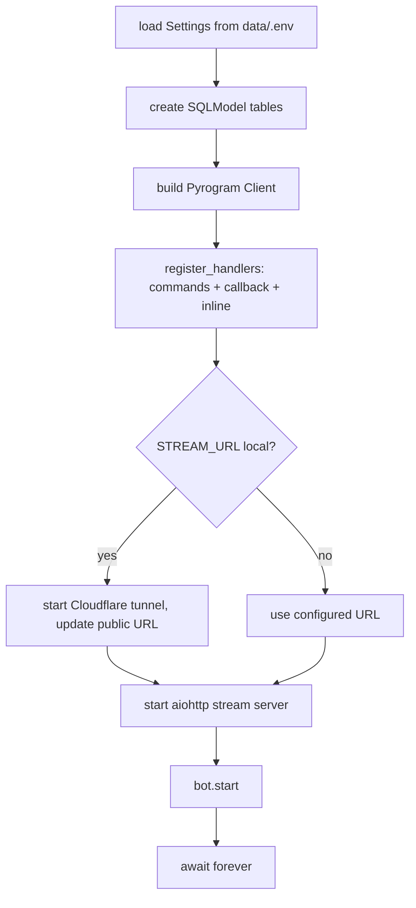

# Architecture

CinemaLibraryBot is a single Python process that runs **two servers in one
asyncio event loop**:

1. A **Telegram bot** on MTProto long-polling (via
   [kurigram](https://github.com/KurimuzonAkuma/pyrogram), a maintained
   Pyrogram fork — imports are `pyrogram.*`).
2. A co-hosted **aiohttp media-streaming server** that streams Telegram files
   to a browser video player, optionally exposed publicly through a Cloudflare
   tunnel.

## Package layout (`src/` layout)

```
src/cinemalibrarybot/
├── __main__.py        # composition root: build client, register handlers,
│                      # start stream server (+ tunnel), start bot, run forever
├── config.py          # pydantic-settings Settings (all env vars, path helpers)
├── client.py          # Pyrogram Client factory
├── handlers/          # "controllers" — one module per command + query routers
├── services/          # external boundaries (IMDb API, OpenSubtitles, Groq LLM)
├── repositories/      # data access: SQLModel models + engines + query fns
└── stream/            # aiohttp streaming server + web player + Cloudflare tunnel
assets/                # static media (stickers, images) — resolved via ASSETS_DIR
data/                  # runtime dir (gitignored): .env, session, cine.db
tests/                 # pytest suite + fixtures
```

> **Historical note:** the code previously lived under a top-level `bot/`
> package and only imported correctly when launched as `python3 bot/` (it relied
> on prefix-less imports like `from entry.entry import bot` and read `.env` from
> a CWD-relative path). It is now a proper installable package with absolute
> imports and config-driven paths, launched via the `cl-bot` console script or
> `python -m cinemalibrarybot`.

## Startup sequence (`__main__.run()`)



## Data model (`repositories/`)

Three SQLModel tables across a mix of engines:

| Model | Store | Purpose |
|---|---|---|
| `Game` | SQLite (`cine.db`) | Movie/series catalog. `file_ids` is a JSON list. (Name is legacy from a prior games bot.) |
| `Users` | Postgres (`USER_DB`) | User records: admin/premium flags, `premium_expires`, download counters. |
| `Post` | Postgres (`POSTGRE_DB_URL`) | Channel posts: `movie_name`, `link`. Backs `/search`, inline query, `#cine`. |

`create_db()` creates all tables idempotently at startup. Data access is a set
of plain functions in `repositories/db_reqs.py` (the repository layer).

## Feature surface (handlers)

- **User:** `/start` (+ deep-link file delivery), `/help`, `/search`, `/info`,
  `/srt`, `/profile`, `/donate`, `/stream`, inline query, `#cine` requests.
- **Admin:** `/post`, `/delpost`, `/fusion`, `/publi`, `/advise`, `/admin`,
  `/premium`, `/vip`, `/count`, `/top10`, `/old`, `/massive` collection flow.
- **Payments:** a fully **manual, human-verified** VIP flow inside the callback
  router (`handlers/cb_queries.py`) — env-configured card/QvaPay details, the
  user uploads a screenshot, an admin taps Accept/Decline, which flips the
  `premium_user` / `premium_expires` DB fields. No payment SDK is involved.

## External boundaries (services)

Each external dependency is isolated in `services/` so it can be mocked:

| Service | Module | Notes |
|---|---|---|
| IMDb-style movie info | `services/movie_search.py` | `get_results` / `get_info_by_id`. The single seam mocked for offline dev (`MOCK_MOVIE_DATA`). |
| OpenSubtitles | `services/search_subts.py` | subtitle search/download. |
| Groq LLM + Google Translate | `services/…functions.py` | title/synopsis translation. |
| Cloudflare tunnel | `stream/tunnel.py` | downloads & runs the `cloudflared` binary. |
| Telegram | `client.py` | the Pyrogram `Client`. |

## Streaming subsystem (`stream/`)

- `server.py` — aiohttp routes: `GET /status`, `GET /watch/{id}?hash=` (HTML
  player page), `GET /stream/{id}?hash=` (byte-range media, HTTP 206).
- `streamer.py` — downloads Telegram file chunks over raw MTProto with caching
  (`cache.py`) and prefetch (`prefetch.py`).
- `file_properties.py` — `FileInfo` + the signed-link hash (`pack_file` /
  `get_short_hash`); links are only valid with the correct `?hash=`.
- `web/` — the player page (`html.py`) plus `static/css` and `static/js`,
  resolved as package resources (not CWD-relative).
